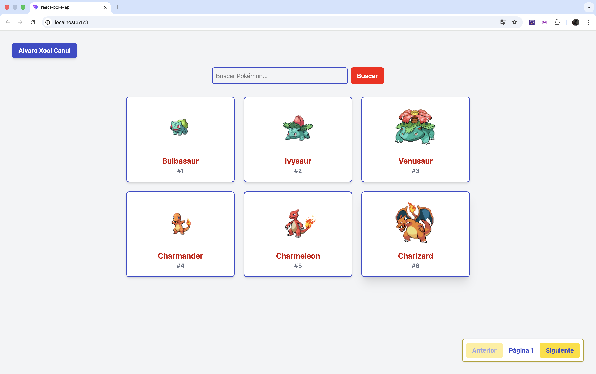

# Examen Técnico Junior Developer

Esta es una aplicación web construida con React que consume la [PokéAPI](https://pokeapi.co/) para mostrar un catálogo de Pokémon. El proyecto fue desarrollado como parte de un examen técnico para la posición de Junior Developer.

## 📸 Vista Previa

## 🛠️ Tecnologías Utilizadas

* **React:** Librería para la construcción de la interfaz de usuario.
* **Redux Toolkit:** Para el manejo del estado global de la aplicación (paginación, término de búsqueda y datos en caché).
* **Tailwind CSS v4:** Para el diseño responsivo, estilos y colores personalizados.

## ✨ Funcionalidades Principales

* **Responsive Grid:** Muestra una lista de 6 Pokémon por página, adaptándose a dispositivos móviles, tablets y escritorio.
* **Paginación:** Navegación fluida entre páginas utilizando el estado global.
* **Buscador Inteligente:** Permite buscar un Pokémon específico por su nombre exacto.
* **Detalles Extendidos (Modal):** Al hacer clic en la tarjeta de un Pokémon, se despliega un modal con información detallada como sus tipos, peso, altura e imagen oficial.
* **Manejo de Estados:** Indicadores visuales de carga (loading) y manejo de errores amigable para el usuario si la búsqueda falla.

## 📂 Arquitectura del Proyecto

El proyecto sigue una estructura modular para separar responsabilidades:
- `/src/components`: Componentes visuales reutilizables (`PokemonCard`, `PokemonModal`).
- `/src/hooks`: Lógica de negocio extraída en Custom Hooks (`usePokemons`) para separar la carga de datos de la UI.
- `/src/store`: Configuración del Almacén Central utilizando Redux Toolkit (`pokemonSlice`).

## 🚀 Ejecución Local

Las instrucciones detalladas paso a paso para ejecutar este proyecto en tu entorno local se encuentran en el archivo adjunto `instrucciones_ejecucion.txt`.